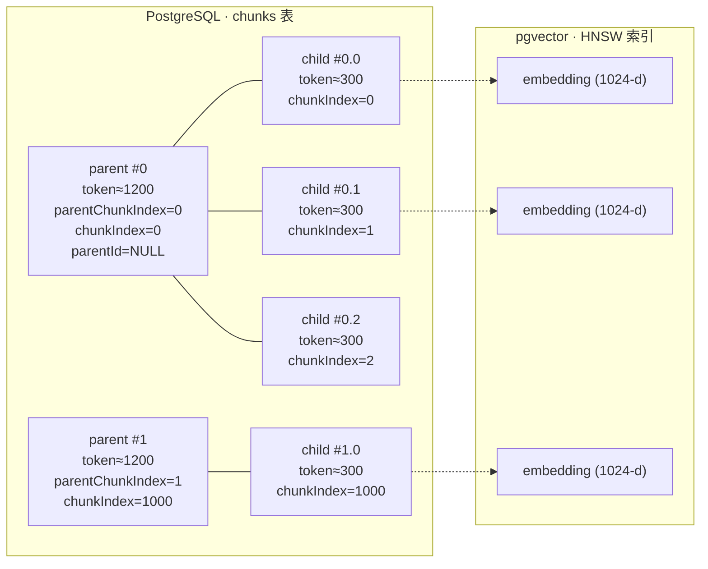
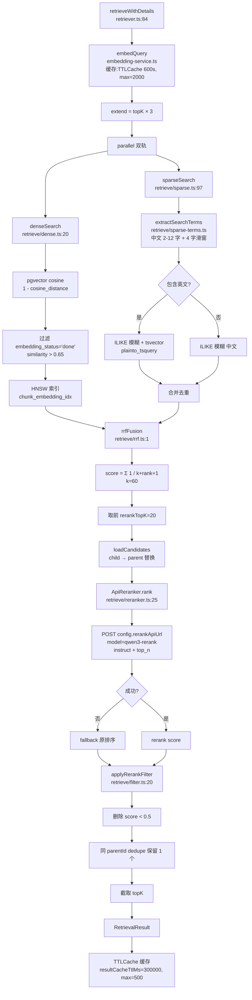
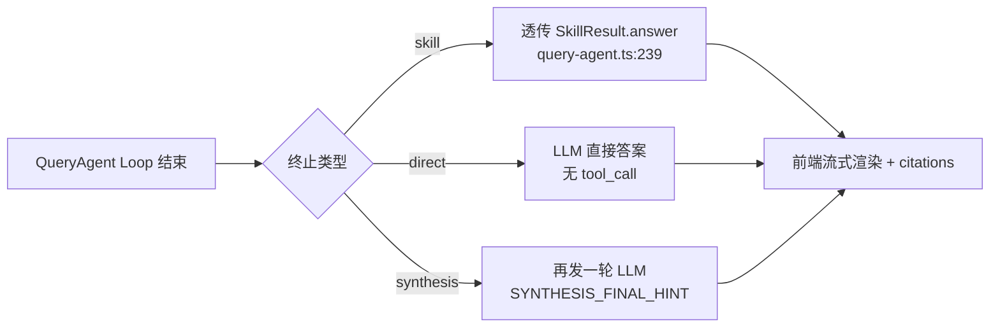
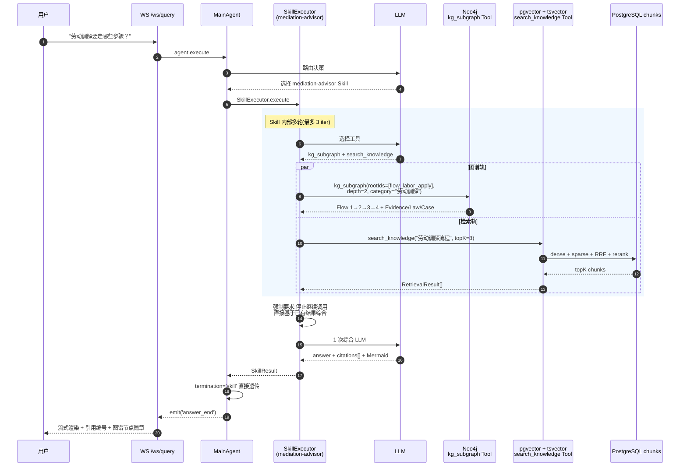
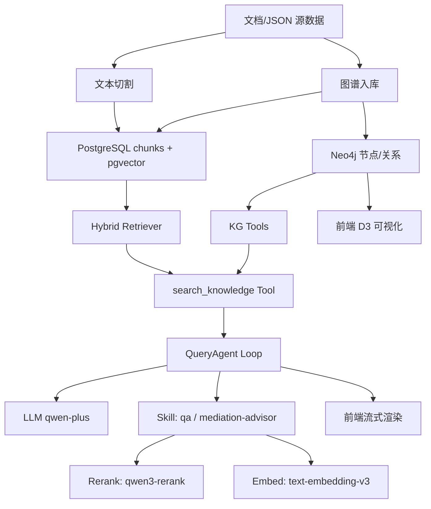

# KB-Core 流程图设计说明

> 本文档梳理 KB-Core 项目的三大核心功能:**文本切割**、**问答(RAG)**、**知识图谱**,并以 Mermaid 流程图配合代码索引呈现整体设计与数据流向。

---

## 目录

1. [文本切割 (Text Chunking)](#1-文本切割-text-chunking)
2. [问答 (Q&A / RAG)](#2-问答-qa--rag)
3. [知识图谱 (Knowledge Graph)](#3-知识图谱-knowledge-graph)

---

## 1. 文本切割 (Text Chunking)

### 1.1 功能概述

KB-Core 采用 **Parent-Child 双层递归切分** 策略,把上传的 TXT / Markdown 文档切成两层 chunk:

- **Parent chunk(≈1200 tokens)**:保留较完整上下文,作为检索命中后回填的完整段落。
- **Child chunk(≈300 tokens)**:用于向量检索,提高召回精度。
- 法律文档会自动识别 `编 / 章 / 节 / 条` 结构并写入 metadata。

切分后的 chunk 会被向量化(`text-embedding-v3`, 1024 维),存入 PostgreSQL `pgvector`,HNSW 索引加速后续检索。

### 1.2 关键代码索引

| 阶段 | 文件 | 行 | 说明 |
|---|---|---|---|
| HTTP 入口 | `app/src/routes/ingest.ts` | 23-77 | POST `/ingest` 接收文件,保存 + 入队 |
| 文件存储 | `app/src/storage/document-storage.ts` | 43-56 | 本地 `/documents` 或阿里 OSS |
| 队列入队 | `app/src/pipeline/document-reset.ts` | 49- | BullMQ `ingest` Queue |
| Worker 消费 | `app/src/pipeline/queue.ts` | 15- | BullMQ Worker 拉取任务 |
| 入库流水线 | `app/src/pipeline/ingest-pipeline.ts` | 28-130 | parse → chunk → persist → embed |
| TXT 解析 | `app/src/parser/txt-parser.ts` | 18- | 读取 + normalize + 法律文档识别 |
| 规范化 | `app/src/utils/text-normalize.ts` | 1- | 去空行、统一 `\n` |
| 切割工厂 | `app/src/splitter/index.ts` | 6- | `createSplitter()` 默认配置 |
| Parent-Child | `app/src/splitter/parent-child-splitter.ts` | 1- | 双层切割主类 |
| 递归切分 | `app/src/splitter/recursive-splitter.ts` | 75- | 多级分隔符递归 |
| 分隔符 | `app/src/splitter/separators.ts` | 12- | L0=`\n` 段落、L1=`。` 句号 |
| 法律结构 | `app/src/splitter/structure-parser.ts` | 30- | 编/章/节/条 解析 |
| Token 计数 | `app/src/splitter/token-counter.ts` | 1- | 中英混合启发式 |
| 向量化 | `app/src/embedding/embedding-service.ts` | 5-50 | OpenAI 兼容 + 缓存 + 重试 |

### 1.3 关键配置

| 配置项 | 默认值 | 出处 |
|---|---|---|
| `CHUNK_PARENT_TOKENS` | 1200 | `app/src/config/index.ts:24` |
| `CHUNK_CHILD_TOKENS` | 300 | `app/src/config/index.ts:25` |
| `CHUNK_OVERLAP_TOKENS` | 50 | `app/src/config/index.ts:26` |
| `EMBEDDING_BATCH_SIZE` | 10 | `app/src/config/index.ts:18` |
| `EMBEDDING_DIM` | 1024 | `app/src/config/index.ts:17` |
| 支持扩展名 | `.txt`, `.md` | `app/src/routes/ingest.ts:15` |
| 单文件上限 | 50 MB | `app/src/routes/ingest.ts:16` |
| UPDATE 批大小 | 25 行 | `app/src/pipeline/ingest-pipeline.ts:117` |

### 1.4 文本切割总流程

```mermaid
flowchart TD
    A[用户上传 .txt / .md<br/>前端控制台 Documents 页] --> B[POST /ingest<br/>routes/ingest.ts:42]
    B --> C{文件类型/大小校验}
    C -->|不通过| X1[返回 4xx 错误]
    C -->|通过| D[saveDocumentFile<br/>storage/document-storage.ts:43]
    D --> D1[本地 ./documents/&lt;nanoid&gt;.txt]
    D --> D2[阿里云 OSS:&lt;key&gt;]
    D --> E[INSERT documents<br/>status='pending']
    E --> F[enqueueIngest<br/>pipeline/document-reset.ts:49]
    F --> G[(BullMQ Queue: ingest)]
    G --> H[Worker startWorker<br/>pipeline/queue.ts:15]
    H --> I[ingestDocument<br/>pipeline/ingest-pipeline.ts:28]

    I --> J[① parse 阶段<br/>parser/txt-parser.ts:21]
    J --> J1[读取文件 → normalizeDocumentContent<br/>utils/text-normalize.ts:1]
    J1 --> J2{detectLawDoc<br/>中华人民共和国 or ≥3 第X条}
    J2 -->|是| J3[写入 lawStructure 编/章/节/条]
    J2 -->|否| J4[普通文档]
    J3 --> K
    J4 --> K

    K[② chunk 阶段] --> K1[createSplitter<br/>splitter/index.ts:6]
    K1 --> L[ParentChildSplitter.split<br/>parent-child-splitter.ts:15]

    L --> L1[parentSplitter.splitRaw<br/>recursive-splitter.ts:75]
    L1 --> L2[L0 段落分隔符 '\n']
    L2 --> L3{未超长?}
    L3 -->|是| L4[作为 parent 候选]
    L3 -->|否| L5[L1 句号分隔符 '。']
    L5 --> L6{仍超长?}
    L6 -->|是| L7[splitAtPeriodBoundary<br/>强制按句号切]
    L6 -->|否| L4
    L7 --> L4
    L4 --> L8[mergeUnits 合并到 minChunkSize<br/>≈ 75 tokens]
    L8 --> L9[addOverlap<br/>≈ 75 tokens]
    L9 --> L10[StructureIndex 注入<br/>bian/zhang/jie/tiao metadata]

    L10 --> M[childSplitter.splitRaw<br/>对每个 parent 再次切分<br/>≈ 300 tokens]
    M --> N[产物: parents[] + children[]<br/>parentChunkIndex · chunkIndex · parentId]

    N --> O[③ 持久化 parents]
    O --> P[构建 parentIdMap]
    P --> Q[持久化 children<br/>parentId=对应 parent]
    Q --> R[④ embed 阶段<br/>embedding-service.ts:20]

    R --> R1[按 batch=10 分批]
    R1 --> R2[POST embeddingApiUrl/embeddings]
    R2 --> R3{成功?}
    R3 -->|否| R4[重试 ×3<br/>指数退避]
    R4 --> R2
    R3 -->|是| R5[UPDATE chunks SET embedding=...::vector<br/>分批 25 行]
    R5 --> S[chunks.embedding_status='done']
    S --> T[documents.status='ready']
    T --> U[前端轮询可见]
```

### 1.5 双层 chunk 数据结构



**索引设计要点:**

- `chunkIndex = parentChunkIndex * 1000 + childIndexWithinParent`
- 检索命中 `child` → 用 `parentId` 反查 `parent` 拿完整上下文回填
- `embedding_status`: `pending` → `done` / `failed`

---

## 2. 问答 (Q&A / RAG)

### 2.1 功能概述

KB-Core 的问答是基于 **WebSocket + Agent Loop** 的流式 RAG,核心特征:

- **协议层**:WebSocket `/ws/query`(Hono + Bun.serve),SSE 流式 token 推送。
- **决策层**:LLM 自主决定调 `Skill` 还是 `Tool`,最多 5 轮迭代。
- **检索层**:`HybridRetriever` = dense(pgvector cosine)+ sparse(tsvector + ILIKE 中文)+ RRF 融合 + Reranker(Qwen3-Rerank)。
- **多轮对话**:前端传 `history`,QueryAgent 直接拼接到 messages 数组。
- **断线恢复**:每个 query 持久化为 `queryJob`,断线后可通过 `POST /api/query/jobs/:jobId` 续传。

### 2.2 关键代码索引

| 阶段 | 文件 | 行 | 说明 |
|---|---|---|---|
| WS 入口 | `app/src/ws/query.ts` | 73-137 | WebSocket 主入口 + queryJob |
| HTTP 同步入口 | `app/src/routes/chat.ts` | 16- | 同步问答接口(非流式) |
| 长任务查询 | `app/src/routes/query-jobs.ts` | 8- | 异步任务状态 |
| 主 Agent | `app/src/agent/main-agent.ts` | 15- | 包装 QueryAgent |
| QueryAgent | `app/src/agent/query-agent.ts` | 24-280 | Agent Loop 核心 |
| System Prompt | `app/src/agent/system-prompt.ts` | 11- | 构造 system prompt |
| LLM 流式 | `app/src/llm/llm-service.ts` | 64-180 | OpenAI 兼容 SSE 解析 |
| Hybrid Retriever | `app/src/retrieve/retriever.ts` | 60-160 | dense+sparse+rerank+RRF 编排 |
| 向量检索 | `app/src/retrieve/dense.ts` | 20- | pgvector cosine |
| 全文检索 | `app/src/retrieve/sparse.ts` | 97- | ILIKE 中文 + tsvector 英文 |
| RRF 融合 | `app/src/retrieve/rrf.ts` | 1- | 倒数排名融合 |
| Reranker | `app/src/retrieve/reranker.ts` | 21- | Qwen3-Rerank HTTP 调用 |
| 分数过滤 | `app/src/retrieve/filter.ts` | 20- | rerankMinScore=0.5 |
| 中文关键词 | `app/src/retrieve/sparse-terms.ts` | 1- | 2-12 字 + 4 字滑窗 |
| Skill 执行器 | `app/src/skills/executor.ts` | 19- | max 3 iter |
| Skill 工具 | `app/src/skills/types.ts` | 49-200 | citations / format / buildContext |
| QA Skill | `app/src/skills/qa/SKILL.md` | 1- | QA Skill 指令模板 |
| 调解双轨 | `app/src/skills/mediation-advisor/SKILL.md` | 25- | KG + RAG 协同 |
| search 工具 | `app/src/tools/search-knowledge.ts` | 133- | search_knowledge Tool |

### 2.3 关键配置

| 配置项 | 默认值 | 出处 |
|---|---|---|
| `SEARCH_TOP_K` | 10 | `app/src/config/index.ts:28` |
| `DENSE_TOP_K_MULTIPLIER` | 3 | `app/src/config/index.ts:29` |
| `RRF_K` | 60 | `app/src/config/index.ts:30` |
| `RERANK_TOP_K` | 20 | `app/src/config/index.ts:31` |
| `DENSE_MIN_SIMILARITY` | 0.65 | `app/src/config/index.ts:32` |
| `RERANK_MIN_SCORE` | 0.5 | `app/src/config/index.ts:33` |
| `AGENT_MAX_ITERATIONS` | 5 | `app/src/config/index.ts:35` |
| `AGENT_MAX_TOOL_CALLS` | 15 | `app/src/config/index.ts:36` |
| `RESULT_CACHE_TTL_MS` | 300000 (5 min) | `app/src/config/index.ts:40` |
| Skill max iter | 3 | `app/src/skills/executor.ts:7` |
| WS schema topK | 1-50 | `app/src/ws/query.ts:27` |
| WS schema history max | 20 条 | `app/src/ws/query.ts:30` |

### 2.4 问答总流程

```mermaid
sequenceDiagram
    autonumber
    participant U as 用户<br/>status Chat.tsx
    participant WS as WS /ws/query<br/>ws/query.ts:78
    participant A as MainAgent<br/>main-agent.ts
    participant Q as QueryAgent<br/>query-agent.ts:53
    participant L as LLMService<br/>llm-service.ts:151
    participant T as Tools<br/>(search_knowledge)
    participant R as HybridRetriever<br/>retriever.ts:60
    participant DB as PostgreSQL<br/>pgvector + tsvector
    participant RR as Qwen3-Rerank<br/>reranker.ts:25

    U->>WS: { type:'query', text, history, topK, datasetId }
    WS->>WS: resolveBearerToken 鉴权
    WS->>WS: queryMessageSchema 校验
    WS->>WS: createQueryJob(用于断线 resume)
    WS->>A: agent.execute(question, options, wsEvents)
    A->>Q: executeWithSystemPrompt(messages, allToolDefs)

    loop Agent Loop (max 5 iter)
        Q->>L: streamOrChat(opts, events)
        L->>L: SSE 解析 token / tool_calls
        L-->>Q: emit('thinking_token') 流式
        L-->>Q: 完成:finish_reason ∈ {stop, tool_calls}

        alt finish_reason = stop
            Q->>Q: directAnswer = content
            Q-->>Q: break → termination='direct'
        else finish_reason = tool_calls
            loop for each tool_call
                Q->>T: executeCallable(name, params)
                alt 是 Skill
                    T->>T: SkillExecutor.execute(max 3 iter)
                    Note over T: 可能内部多次<br/>调 search_knowledge + 1 次 LLM 综合
                    T-->>Q: SkillResult {answer, citations[]}
                    Q->>Q: skillDone=true; break
                else 是 Tool (如 search_knowledge)
                    T->>R: retrieveWithDetails(query, topK, datasetId)
                    R->>R: embedQuery(embed + cache)
                    par 并行检索
                        R->>DB: denseSearch (pgvector cosine)
                        R->>DB: sparseSearch (ILIKE + tsvector)
                    end
                    R->>R: rrfFusion(dense, sparse, k=60)
                    R->>RR: rank(query, top20, topK)
                    RR-->>R: reranked results
                    R->>R: applyRerankFilter(score≥0.5) + dedupe
                    R-->>T: RetrievalResult[]
                    T-->>Q: tool result → messages.push({role:'tool'})
                end
            end
        end
    end

    Q->>Q: resolveFinalAnswer (types.ts:185)
    alt termination='skill'
        Q-->>U: emit('answer_end', skill.answer)
    else termination='direct'
        Q-->>U: emit('answer_end', directAnswer)
    else termination='synthesis'
        Q->>L: 再发一轮 LLM (带 SYNTHESIS_FINAL_HINT)
        L-->>Q: 综合答案
        Q-->>U: emit('answer_end')
    end
```

### 2.5 检索内部流程(Hybrid Retriever)



### 2.6 三种终止路径



| 终止类型 | 触发条件 | 是否二次 LLM |
|---|---|---|
| `skill` | LLM 调用 Skill 且返回 `SkillResult` | 否,直接透传 |
| `direct` | LLM 直接回复(闲聊) | 否 |
| `synthesis` | LLM 只调用了 Tool,未命中 Skill | 是,再综合一轮 |

---

## 3. 知识图谱 (Knowledge Graph)

### 3.1 功能概述

KB-Core 使用 **Neo4j** 存储知识图谱,数据来源是 `app/data/kg-data.json`(Zod 校验后入库)。

- **节点类型(4 种)**: `Flow`(流程)、`Law`(法规)、`Evidence`(证据)、`Case`(案例)。
- **关系类型(8 种)**: `NEXT` / `BRANCH_TO` / `APPLIES_TO` / `REQUIRES` / `MAY_REQUIRE` / `REFERS_TO` / `KEY_EVIDENCE` / `CITES` / `RELATED`。
- **双向同步**:Law 节点的法条原文通过 splitter + embedding 写入 PostgreSQL `chunks`,关联字段 `kg_node_id` ↔ `chunk_id`。
- **前端可视化**: D3.js 力导向布局,4 个预设视图,支持拖拽 / 缩放 / 双击重定位。
- **与 RAG 协同**: `mediation-advisor` Skill 同时调 `kg_subgraph` 和 `search_knowledge`,双轨综合。

### 3.2 关键代码索引

| 阶段 | 文件 | 行 | 说明 |
|---|---|---|---|
| Neo4j 客户端 | `app/src/kg/client.ts` | 15-50 | 单例 Driver + withSession |
| 索引/约束 | `app/src/kg/client.ts` | 122- | ensureKgReady |
| JSON 入库 | `app/src/kg/ingest.ts` | 65-250 | kg-data.json → Neo4j + Postgres |
| 边类型映射 | `app/src/kg/ingest.ts` | 155- | edge.label → relType |
| Law → chunks | `app/src/kg/ingest.ts` | 198- | splitter + embedding 同步回填 |
| KG 路由 | `app/src/routes/kg.ts` | 34- | search/nodes/subgraph/path/ingest/stats |
| search 工具 | `app/src/kg/tools/kg_search_nodes.ts` | 16- | 全文索引查询 |
| subgraph 工具 | `app/src/kg/tools/kg_subgraph.ts` | 15- | 拉子图 |
| 反查工具 | `app/src/kg/tools/kg_to_chunk.ts` | 26- | 图节点 → 关联 chunk |
| get_node 工具 | `app/src/kg/tools/kg_get_node.ts` | - | 节点详情 |
| neighbors 工具 | `app/src/kg/tools/kg_neighbors.ts` | - | 邻居节点 |
| path 工具 | `app/src/kg/tools/kg_path.ts` | - | 最短路径 |
| 工具注册 | `app/src/kg/tools/index.ts` | - | KG_TOOLS 入口 |
| chunks 字段 | `app/src/db/schema/chunk.ts` | 35- | `kgNodeId` 字段 |
| 调解双轨 Skill | `app/src/skills/mediation-advisor/SKILL.md` | 25- | KG+RAG 双轨指令 |
| 前端 API | `status/src/api/kgApi.ts` | 33- | KG API 封装 |
| KG 页面 | `status/src/pages/KnowledgeGraph/index.tsx` | - | 前端图谱页面 |
| D3 画布 | `status/src/pages/KnowledgeGraph/GraphCanvas.tsx` | - | 力导向 SVG |
| 详情面板 | `status/src/pages/KnowledgeGraph/GraphDetailPanel.tsx` | - | 节点详情 |
| 布局算法 | `status/src/pages/KnowledgeGraph/layout.ts` | - | d3-force |
| 颜色规则 | `status/src/pages/KnowledgeGraph/theme.ts` | - | 节点颜色 / 形状 |

### 3.3 关键配置

| 配置项 | 默认值 | 出处 |
|---|---|---|
| `KG_ENABLED` | true | `app/src/config/index.ts:61` |
| `NEO4J_URL` | `bolt://localhost:7687` | `app/src/config/index.ts:58` |
| `NEO4J_USER` / `NEO4J_PASSWORD` | `neo4j` / `neo4j_dev_password` | `app/src/config/index.ts:59-60` |
| `KG_DEFAULT_ROOT_LABOR` | `flow_labor_apply` | `app/src/config/index.ts:62` |
| `KG_DEFAULT_ROOT_NEIGHBOR` | `flow_neighbor_register` | `app/src/config/index.ts:63` |
| Driver `maxConnectionPoolSize` | 50 | `app/src/kg/client.ts:25` |
| Driver `connectionTimeout` | 5000ms | `app/src/kg/client.ts:26` |
| `kg_subgraph` 默认 `depth` | 2 (范围 1-3) | `app/src/kg/tools/kg_subgraph.ts:61` |
| `kg_search_nodes` `limit` | 20 (1-50) | `app/src/routes/kg.ts:42` |
| `kg_neighbors` `limit` | 50 (1-200) | `app/src/routes/kg.ts:66` |
| `kg_path` `maxDepth` | 5 (1-10) | `app/src/routes/kg.ts:89` |
| 节点颜色 | Law=#1890ff 蓝 / Case=#52c41a 绿 / Evidence=#fa8c16 橙 / Flow=#722ed1 紫 | `docs/知识图谱设计.md:651` |
| 节点形状 | Law=rect / Case=circle / Evidence=diamond / Flow=rect(rx=12) | `docs/知识图谱设计.md:651` |

### 3.4 图谱入库流程

```mermaid
flowchart TD
    A[docs/kg-data.json] --> B[KgDataSchema Zod 校验<br/>kg/ingest.ts:65]
    B --> C[ensureKgDataset<br/>kg/ingest.ts]
    C --> C1[创建 datasets 行<br/>kind='kg']
    C1 --> C2[name → sha256 前 32 位<br/>→ neo4jDatasetId int]

    C2 --> D[ensureKgReady<br/>kg/client.ts:122]
    D --> D1[唯一性约束<br/>flow_id / law_id / ev_id / case_id]
    D --> D2[索引<br/>category × stepOrder × 4 Label]
    D --> D3[全文索引 node_fulltext<br/>label/category]

    D3 --> E[DETACH DELETE<br/>旧节点 按 neo4jDatasetId]
    E --> F[按 Label 分组<br/>UNWIND 批量 CREATE]

    F --> F1[:Flow {id, label, category,<br/>datasetId, stepOrder}]
    F --> F2[:Law {id, label, category,<br/>lawText, datasetId}]
    F --> F3[:Evidence {id, label, description}]
    F --> F4[:Case {id, label, fact}]

    F1 --> G[批量建边<br/>MATCH + apoc.create.relationship]
    F2 --> G
    F3 --> G
    F4 --> G

    G --> G1[mapRelType<br/>kg/ingest.ts:155]
    G1 --> G2{NEXT / BRANCH_TO /<br/>APPLIES_TO / REQUIRES /<br/>MAY_REQUIRE / REFERS_TO /<br/>KEY_EVIDENCE / CITES /<br/>RELATED}
    G2 --> H[Law 节点同步回填 chunks]

    H --> H1[每个 Law 节点 → 1 虚拟 document<br/>title=`[KG] &lt;label&gt;(&lt;id&gt;)`<br/>docType='kg_law']
    H1 --> H2[splitter.split<br/>单条 chunk]
    H2 --> H3[embeddingService.embedBatch<br/>得到 1 个向量]
    H3 --> H4[chunks.kg_node_id = node.id]

    H4 --> I[backfillChunkIds<br/>从 chunks DISTINCT ON kg_node_id<br/>→ 写回 Neo4j chunkId 字段]
    I --> J[入库完成]
```

### 3.5 边类型映射

| edge.label 关键字 | Neo4j relType | 视觉 |
|---|---|---|
| `下一步` / `同意调解` / `达成一致` / `申请司法确认` / `归档` | `NEXT` | solid |
| 包含 `拒绝` 或 `未达成一致` | `BRANCH_TO` | solid / dashed |
| `法律依据` | `APPLIES_TO` | solid |
| 包含 `关键证据` | `KEY_EVIDENCE` | solid |
| `需要核对` / `需要材料` 或包含 `需采集/调取/提供` | `REQUIRES` | dashed |
| 包含 `可选` | `MAY_REQUIRE` | dashed |
| 包含 `参考案例` | `REFERS_TO` | solid |
| 包含 `援引` | `CITES` | solid |
| 其他 | `RELATED` | - |

### 3.6 问答双轨协同(KG + RAG)



### 3.7 前端 KG 页面

```mermaid
flowchart LR
    A[KnowledgeGraph/index.tsx] --> B[左侧 4 个预设视图]
    B --> B1[全部]
    B --> B2[劳动调解全流程]
    B --> B3[邻里调解全流程]
    B --> B4[劳动调解 + 关键证据]

    A --> C[中间 D3.js SVG<br/>GraphCanvas.tsx]
    C --> C1[d3-force 力导向布局]
    C --> C2[d3.zoom 缩放<br/>scaleExtent=[0.1, 4]]
    C --> C3[节点拖拽固定]
    C --> C4[双击:以该节点为新根<br/>重新拉子图]

    A --> D[右侧详情面板<br/>GraphDetailPanel.tsx]
    D --> D1[节点 meta]
    D --> D2[关联 chunk 文本]
    D --> D3[跳 Chat 按钮<br/>?kgNode=xxx]

    A --> E[theme.ts]
    E --> E1[Law: 蓝 #1890ff · rect]
    E --> E2[Case: 绿 #52c41a · circle]
    E --> E3[Evidence: 橙 #fa8c16 · diamond]
    E --> E4[Flow: 紫 #722ed1 · rect rx=12]

    A --> F[边样式]
    F --> F1[solid 实线]
    F --> F2[dashed 虚线<br/>stroke-dasharray=5,4]
    F --> F3[edge label 显示]
```

### 3.8 数据双向同步

```mermaid
flowchart LR
    subgraph PGS[PostgreSQL]
        D[datasets<br/>kind='kg']
        DOC[documents<br/>title=`[KG] xxx(id)`<br/>docType='kg_law']
        CHK[chunks<br/>kg_node_id 字段]
        EMB[embedding 1024-d<br/>pgvector HNSW]
    end

    subgraph NJS[Neo4j]
        F[:Flow]
        L[:Law<br/>chunkId 字段]
        E[:Evidence]
        C[:Case]
    end

    JSON[kg-data.json] -->|kg/ingest.ts:198| DOC
    DOC --> CHK
    CHK --> EMB
    EMB -.->|backfillChunkIds| L

    JSON -->|kg/ingest.ts:65| F
    JSON -->|kg/ingest.ts:65| L
    JSON -->|kg/ingest.ts:65| E
    JSON -->|kg/ingest.ts:65| C

    F -.->|NEXT/BRANCH_TO| F
    F -.->|APPLIES_TO| L
    F -.->|KEY_EVIDENCE| E
    F -.->|REFERS_TO/CITES| C
```

**反查路径:**

- `kg_to_chunk` Tool:节点 id → `chunks.kg_node_id` → 法条原文 + embedding 上下文
- `search_knowledge`:命中 `kg_law` 类 chunk → 引用时显示关联图谱节点徽章

---

## 附录:三大功能的依赖关系



---

## 总结

| 功能 | 入口 | 核心算法 | 存储 | 前端 |
|---|---|---|---|---|
| **文本切割** | `POST /ingest` | Parent-Child 双层递归 + 多级分隔符 | PostgreSQL chunks + pgvector HNSW | Documents 管理页 |
| **问答** | `WS /ws/query` | Agent Loop + Hybrid Retriever (dense+sparse+RRF+Rerank) | 复用 chunks + queryJob | Chat 页(流式 + citations) |
| **知识图谱** | `POST /kg/ingest` + `GET /kg/*` | 标签路由 + APOC 关系 + Law→chunks 同步 | Neo4j + chunks.kg_node_id | KnowledgeGraph 页(D3 力导向) |

三大功能通过 `chunks.kg_node_id` 字段与 `mediation-advisor` Skill 实现双轨协同,使系统在 RAG 召回之上叠加了知识图谱的结构化推理能力。
|