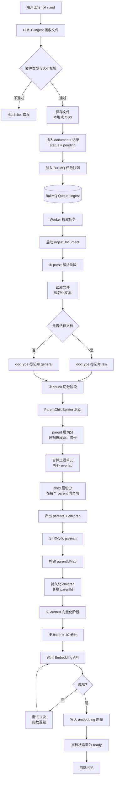
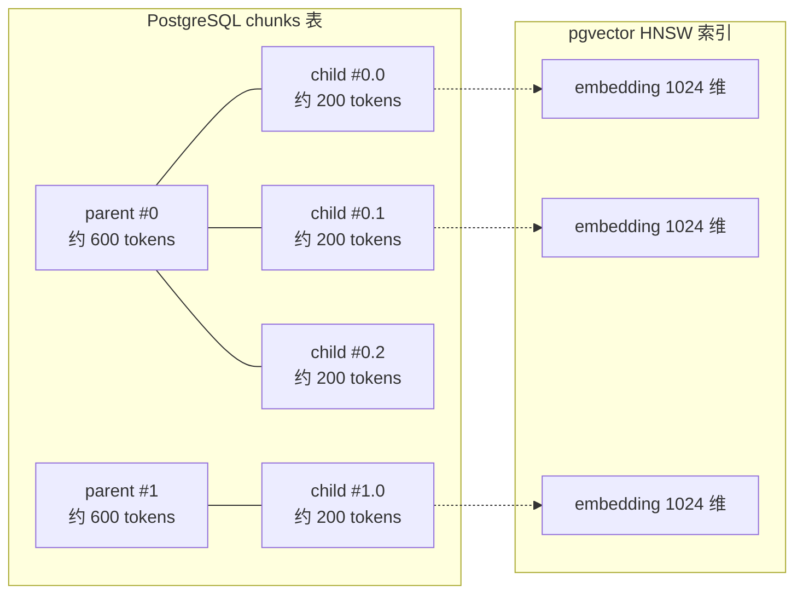
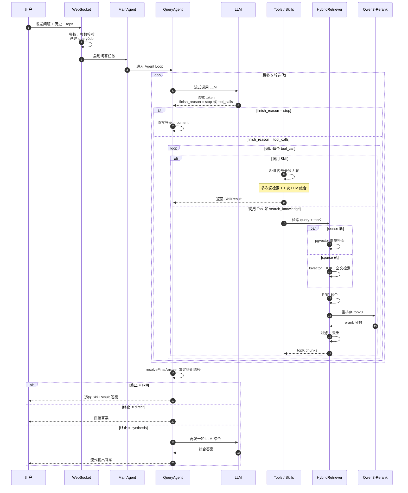
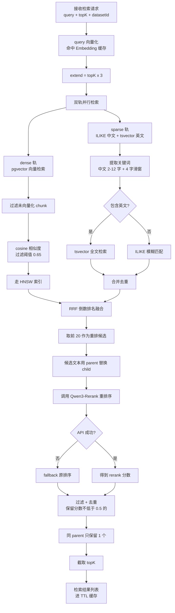
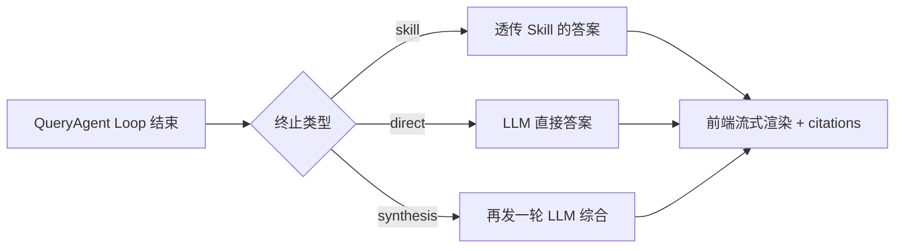
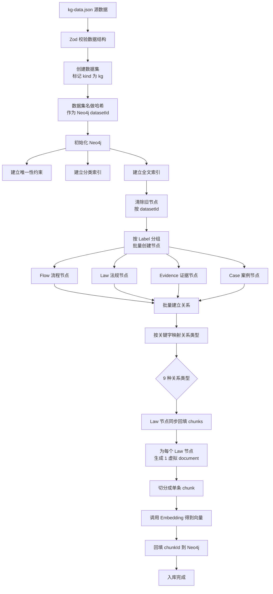
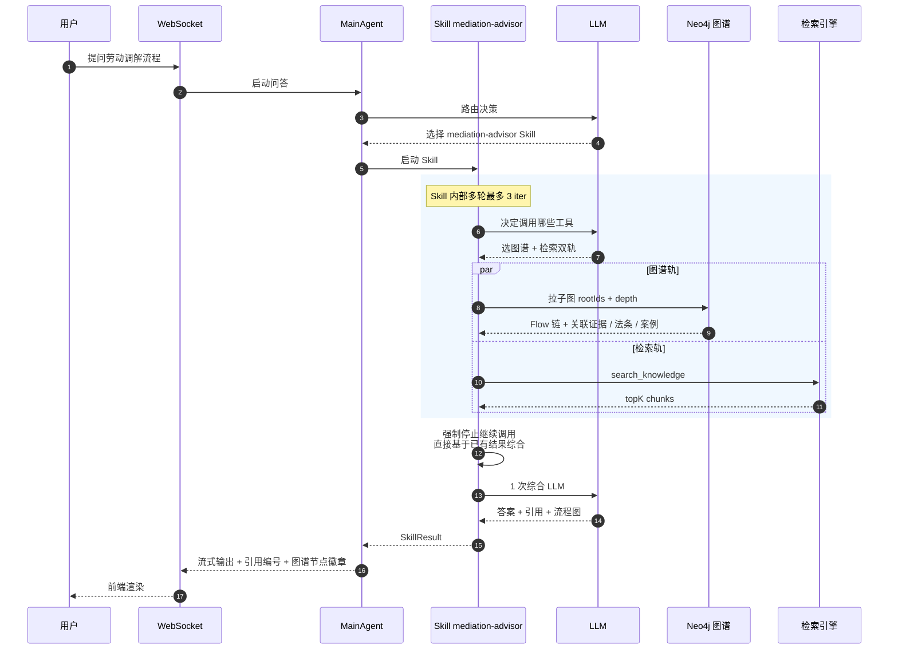
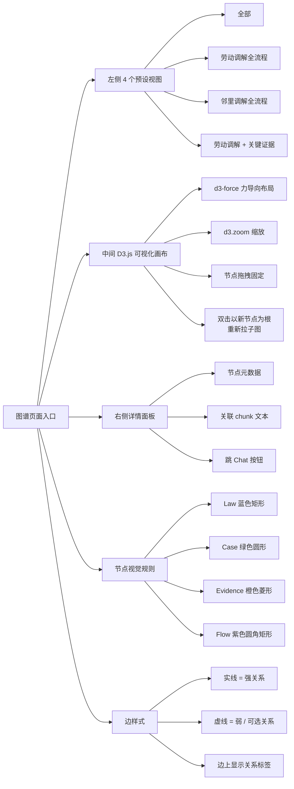
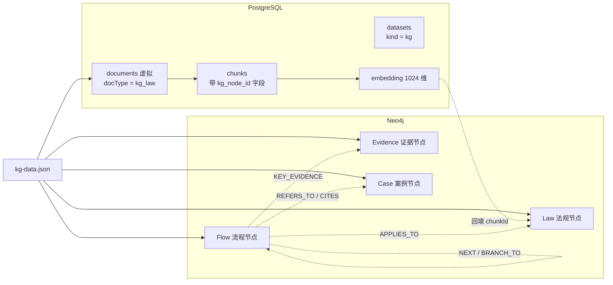
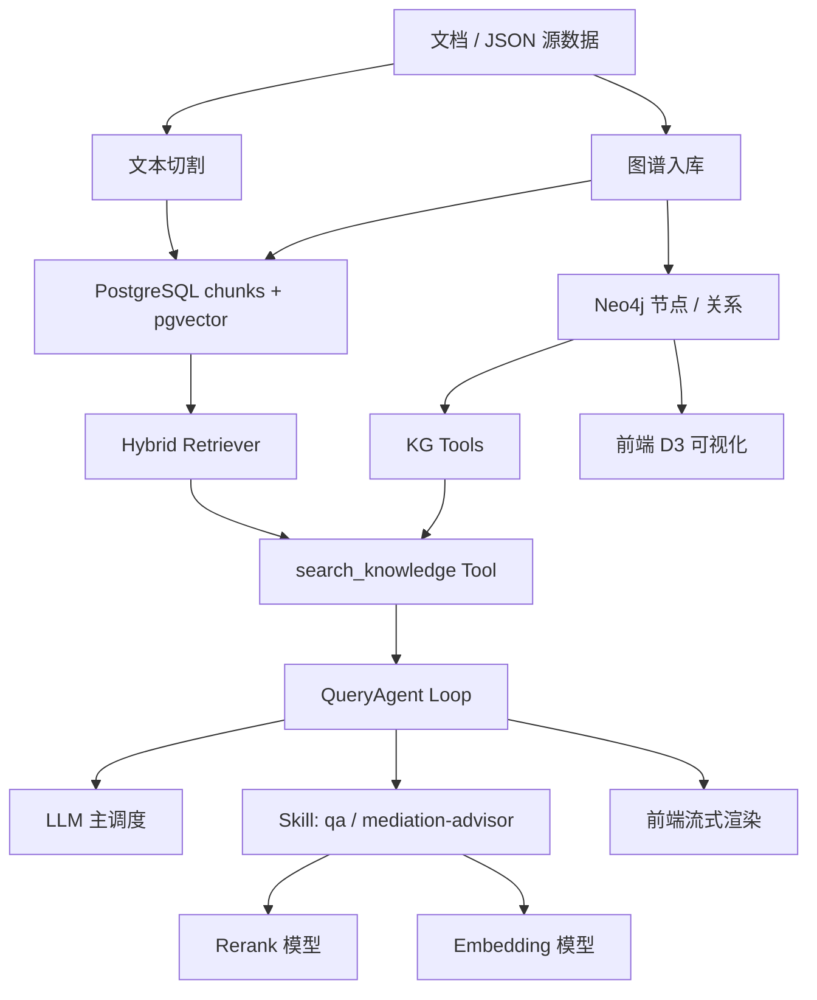

# KB-Core 流程图设计说明

> 本文档梳理 KB-Core 项目的三大核心功能:**文本切割**、**问答(RAG)**、**知识图谱**,并以 Mermaid 流程图呈现整体设计与数据流向。

---

## 目录

1. [文本切割 (Text Chunking)](#1-文本切割-text-chunking)
2. [问答 (Q&A / RAG)](#2-问答-qa--rag)
3. [知识图谱 (Knowledge Graph)](#3-知识图谱-knowledge-graph)

---

## 1. 文本切割 (Text Chunking)

### 1.1 功能概述

KB-Core 采用 **Parent-Child 双层递归切分** 策略,把上传的 TXT / Markdown 文档切成两层 chunk:

- **Parent chunk(≈600 tokens)**:保留较完整上下文,作为检索命中后回填的完整段落。
- **Child chunk(≈200 tokens)**:用于向量检索,提高召回精度。

切分后的 chunk 会被向量化(`text-embedding-v3`, 1024 维),存入 PostgreSQL `pgvector`,HNSW 索引加速后续检索。

### 1.2 关键配置

| 配置项 | 默认值 |
|---|---|
| `CHUNK_PARENT_TOKENS` | 600 |
| `CHUNK_CHILD_TOKENS` | 200 |
| `CHUNK_OVERLAP_TOKENS` | 30 |
| `EMBEDDING_BATCH_SIZE` | 10 |
| `EMBEDDING_DIM` | 1024 |
| 支持扩展名 | `.txt`, `.md` |
| 单文件上限 | 50 MB |
| UPDATE 批大小 | 25 行 |

### 1.3 文本切割总流程

### 1.4 双层 chunk 数据结构

**设计要点:**

- 每个 parent 内嵌多个 child,parent 提供完整上下文,child 用于精确检索
- 命中 child 后,用 parentId 反查 parent 拿完整段落回填
- 状态机: `pending` → `done` / `failed`

---

## 2. 问答 (Q&A / RAG)

### 2.1 功能概述

KB-Core 的问答是基于 **WebSocket + Agent Loop** 的流式 RAG,核心特征:

- **协议层**:WebSocket `/ws/query`,SSE 流式 token 推送。
- **决策层**:LLM 自主决定调 Skill 还是 Tool,最多 5 轮迭代。
- **检索层**:混合检索 = 向量检索(pgvector cosine)+ 全文检索(tsvector + ILIKE 中文)+ RRF 融合 + Reranker 重排序。
- **多轮对话**:前端传 `history`,QueryAgent 直接拼接到消息列表。
- **断线恢复**:每个 query 持久化为 queryJob,断线后可续传。

### 2.2 关键配置

| 配置项 | 默认值 |
|---|---|
| `SEARCH_TOP_K` | 10 |
| `DENSE_TOP_K_MULTIPLIER` | 3 |
| `RRF_K` | 60 |
| `RERANK_TOP_K` | 20 |
| `DENSE_MIN_SIMILARITY` | 0.65 |
| `RERANK_MIN_SCORE` | 0.5 |
| `AGENT_MAX_ITERATIONS` | 5 |
| `AGENT_MAX_TOOL_CALLS` | 15 |
| `RESULT_CACHE_TTL_MS` | 300000 (5 min) |
| Skill max iter | 3 |
| WS schema topK | 1-50 |
| WS schema history max | 20 条 |

### 2.3 问答总流程

### 2.4 检索内部流程(Hybrid Retriever)

### 2.5 三种终止路径

| 终止类型 | 触发条件 | 是否二次 LLM |
|---|---|---|
| `skill` | LLM 调用 Skill 且返回 SkillResult | 否,直接透传 |
| `direct` | LLM 直接回复(闲聊) | 否 |
| `synthesis` | LLM 只调用了 Tool,未命中 Skill | 是,再综合一轮 |

---

## 3. 知识图谱 (Knowledge Graph)

### 3.1 功能概述

KB-Core 使用 **Neo4j** 存储知识图谱,数据来源是 `app/data/kg-data.json`(Zod 校验后入库)。

- **节点类型(4 种)**: Flow(流程)、Law(法规)、Evidence(证据)、Case(案例)。
- **关系类型(8 种)**: NEXT / BRANCH_TO / APPLIES_TO / REQUIRES / MAY_REQUIRE / REFERS_TO / KEY_EVIDENCE / CITES / RELATED。
- **双向同步**:Law 节点的法条原文通过 splitter + embedding 写入 PostgreSQL chunks,关联字段 kg_node_id ↔ chunk_id。
- **前端可视化**: D3.js 力导向布局,4 个预设视图,支持拖拽 / 缩放 / 双击重定位。
- **与 RAG 协同**: mediation-advisor Skill 同时调图谱工具和检索工具,双轨综合。

### 3.2 关键配置

| 配置项 | 默认值 |
|---|---|
| `KG_ENABLED` | true |
| `NEO4J_URL` | `bolt://localhost:7687` |
| `NEO4J_USER` / `NEO4J_PASSWORD` | `neo4j` / `neo4j_dev_password` |
| `KG_DEFAULT_ROOT_LABOR` | `flow_labor_apply` |
| `KG_DEFAULT_ROOT_NEIGHBOR` | `flow_neighbor_register` |
| Driver `maxConnectionPoolSize` | 50 |
| Driver `connectionTimeout` | 5000ms |
| `kg_subgraph` 默认 `depth` | 2 (范围 1-3) |
| `kg_search_nodes` `limit` | 20 (1-50) |
| `kg_neighbors` `limit` | 50 (1-200) |
| `kg_path` `maxDepth` | 5 (1-10) |
| 节点颜色 | Law=蓝 / Case=绿 / Evidence=橙 / Flow=紫 |
| 节点形状 | Law=矩形 / Case=圆形 / Evidence=菱形 / Flow=圆角矩形 |

### 3.3 图谱入库流程

### 3.4 边类型映射

| edge.label 关键字 | Neo4j relType | 视觉 |
|---|---|---|
| 下一步 / 同意调解 / 达成一致 / 申请司法确认 / 归档 | NEXT | 实线 |
| 包含 拒绝 或 未达成一致 | BRANCH_TO | 实线 / 虚线 |
| 法律依据 | APPLIES_TO | 实线 |
| 包含 关键证据 | KEY_EVIDENCE | 实线 |
| 需要核对 / 需要材料 或包含 需采集 / 调取 / 提供 | REQUIRES | 虚线 |
| 包含 可选 | MAY_REQUIRE | 虚线 |
| 包含 参考案例 | REFERS_TO | 实线 |
| 包含 援引 | CITES | 实线 |
| 其他 | RELATED | - |

### 3.5 问答双轨协同(KG + RAG)

### 3.6 前端 KG 页面

### 3.7 数据双向同步

**反查路径:**

- 图节点 → 关联 chunk: 通过 kg_node_id 字段
- 检索命中 kg_law 类 chunk → 引用时显示关联图谱节点徽章

---

## 附录:三大功能的依赖关系

---

## 总结

| 功能 | 入口 | 核心算法 | 存储 | 前端 |
|---|---|---|---|---|
| 文本切割 | POST /ingest | Parent-Child 双层递归 + 多级分隔符 | PostgreSQL chunks + pgvector HNSW | Documents 管理页 |
| 问答 | WS /ws/query | Agent Loop + Hybrid Retriever | 复用 chunks + queryJob | Chat 页(流式 + citations) |
| 知识图谱 | POST /kg/ingest + GET /kg/* | 关系映射 + Law → chunks 同步 | Neo4j + chunks.kg_node_id | KnowledgeGraph 页(D3 力导向) |

三大功能通过 kg_node_id 字段与 mediation-advisor Skill 实现双轨协同,使系统在 RAG 召回之上叠加了知识图谱的结构化推理能力。
