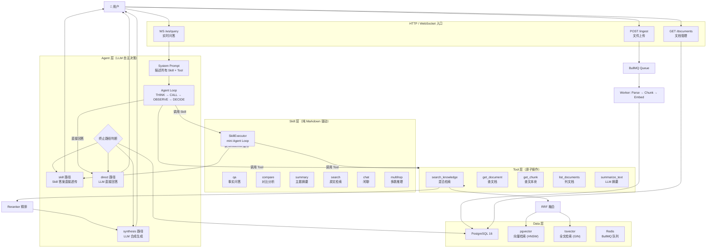
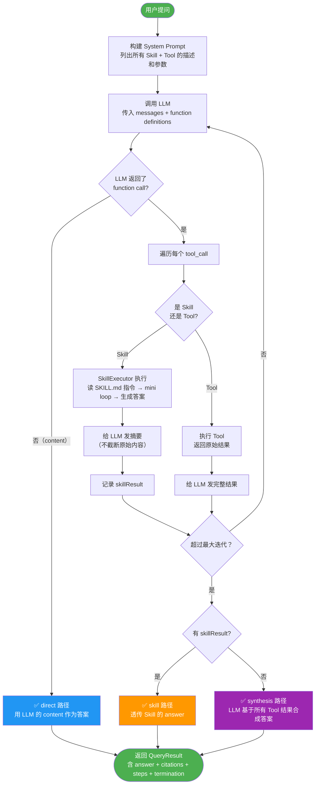
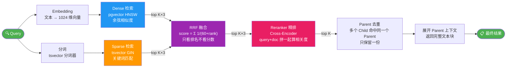
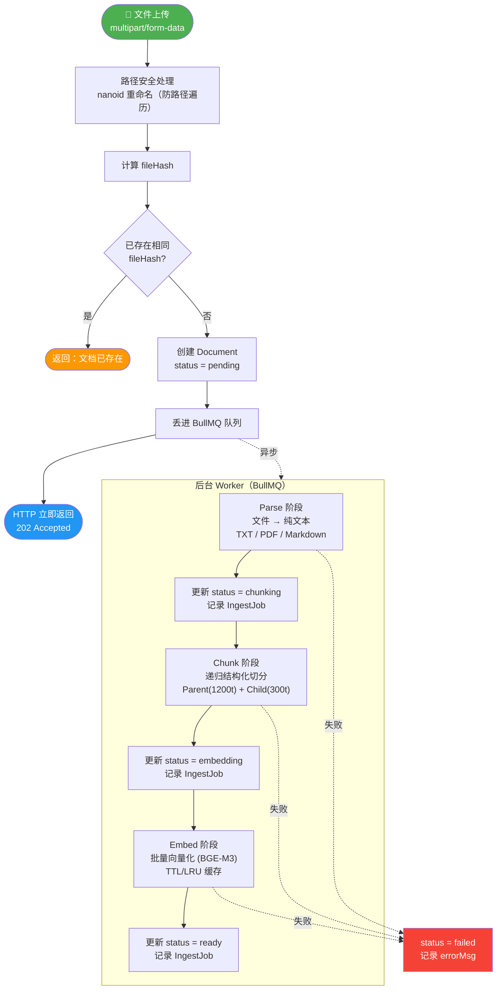
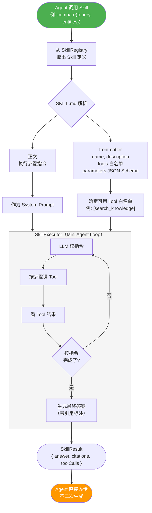
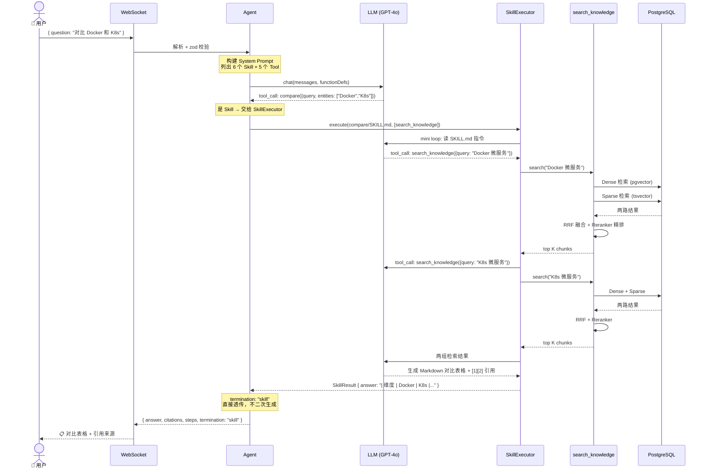
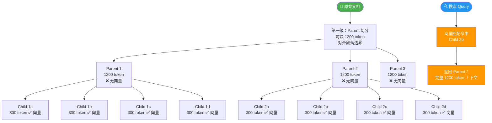

# Knowledge Core 分享大纲 + 流程图

> 建议时长 45 分钟 | 跨团队技术分享

---

## 分享大纲

### Slide 1 — 封面（1 min）

- 标题：**Knowledge Core —— 基于 Agent 的智能知识库**
- 副标题：让 LLM 自己决定怎么回答你的问题
- 你的名字 / 团队 / 日期

---

### Slide 2-3 — 开场 Demo（5 min）

**不要放 slides，直接开系统**

Demo 1：事实问答
```
问："Kubernetes 的 Pod 是什么？"
→ 展示：检索过程 → 带 [1][2] 引用的回答 → 来源文档链接
```

Demo 2：对比分析
```
问："对比 Docker Compose 和 Kubernetes 在本地开发场景的优劣"
→ 展示：Agent 选择 compare skill → 分别检索 → 对比表格
```

Demo 3（可选）：闲聊
```
问："你好"
→ 展示：Agent 判断不需要检索 → 直接回答
```

> 💡 先 Demo 再讲原理。大家会带着"怎么做到的"好奇心听后面。

**Backup 计划**：提前录屏，现场挂了切视频。

---

### Slide 4 — 痛点：知识管理的三个难题（3 min）

```
📄 文档散落各处，找信息靠缘分
🔑 换个表述就搜不到（关键词搜索的局限）
🧩 跨文档的对比、综合推理需要人肉逐篇翻
```

---

### Slide 5 — 传统 RAG vs 我们的方案（3 min）

| | 传统 RAG | KB-Core |
|--|---------|---------|
| 流程 | 固定管线：检索→生成 | Agent 自主编排 |
| 路由 | if/else 关键词匹配 | LLM 语义理解 |
| 扩展 | 加功能改代码 | 加一个 Markdown 文件 |
| 复合问题 | 无法处理 | 自动组合多个 Skill |

**一句话**：传统 RAG 是流水线工人，我们是项目经理。

---

### Slide 6 — 分层架构（3 min）

```
Agent（LLM 自主决策）
  └── Skill（Markdown 驱动，固化最佳实践）
        └── Tool（原子操作，可独立复用）
              └── Data（PostgreSQL + pgvector）
```

> 核心原则：Agent 层灵活，Skill 层固化

---

### Slide 7-8 — Agent 层详解（7 min）

**Agent Loop 四步循环**：

```
THINK → CALL → OBSERVE → DECIDE
                         ↓
                    继续？→ 回到 THINK
                    完成？→ 返回答案
```

**三种终止路径**（设计亮点，值得展开）：

| 路径 | 什么时候触发 | 怎么处理 | 为什么 |
|------|------------|---------|--------|
| skill | 调了 Skill | 直接透传答案 | Skill 已经高质量生成，再合成会丢信息 |
| synthesis | 只调了 Tool | 最后做一次合成 | 原始数据需要 LLM 组织语言 |
| direct | 没调任何东西 | 用 LLM 直接回答 | 闲聊不需要检索 |

> 💡 **踩坑故事**：最初所有路径都让 Agent 二次生成，发现 Skill 的引用标注被丢了，token 也白白浪费。

---

### Slide 9-10 — Skill 层详解（7 min）⭐ 全场 Wow 点

**展示一个真实的 SKILL.md 文件**：

```markdown
---
name: compare
description: "对比两个或多个概念/技术/方案的异同。"
tools:
  - search_knowledge
parameters:
  type: object
  properties:
    query:
      type: string
      description: "对比的主题"
    entities:
      type: array
      items: { type: string }
      description: "要对比的对象列表"
---

# Compare Skill

你的任务是对比分析多个对象。

## 执行步骤
1. 从参数取出 entities 列表
2. 对每个 entity，调用 search_knowledge 分别检索
3. 汇总所有检索结果
4. 生成 Markdown 对比表格，标注来源
```

**关键卖点**：
- 改流程？改 Markdown 即刻生效，不用编译部署
- 加新 Skill？建目录 + 写 Markdown，系统自动发现
- 零代码 = 非开发者也能理解/参与 Skill 编写

> 💡 **Live demo**：当场改一行 SKILL.md 指令，演示效果立刻变化。

---

### Slide 11 — Tool 层速览（2 min）

| Tool | 干什么 |
|------|--------|
| search_knowledge | 混合检索 |
| get_document | 查文档元数据 |
| get_chunk | 查文本块+父级上下文 |
| list_documents | 列文档 |
| summarize_text | LLM 摘要 |

> 不多讲，快速过。

---

### Slide 12-13 — 混合检索系统（8 min）

**为什么不只用向量搜索？**

```
问题 A："第39条规定" 
  → 向量搜索可能返回"第40条"（语义近但错了）
  → 关键词搜索精确命中 ✓

问题 B："怎么用 Docker 部署"
  → 文档写的是"如何使用容器化部署"
  → 关键词搜索搜不到 ✗
  → 向量搜索语义匹配 ✓

结论：两个都要，取长补短
```

**检索流水线**（见下方流程图）

**Parent-Child 分块**：

```
Parent（1200 token，无向量）
  ├── Child 1（300 token，✓ 向量）
  ├── Child 2（300 token，✓ 向量）
  └── Child 3（300 token，✓ 向量）
```

检索命中 Child → 返回 Parent（完整上下文）
> 类比：查字典——关键词找到页码（Child），翻开读整页（Parent）

---

### Slide 14 — 数据入库（3 min）

```
文件上传 → nanoid 重命名 → fileHash 查重
  → BullMQ 异步队列 → HTTP 立即返回"已接收"
  → 后台 Worker：Parse → Chunk → Embed
  → 状态更新 ready
```

> 重点讲异步设计：入库要几分钟，不能让 HTTP 阻塞。

---

### Slide 15 — 技术选型一览（3 min）

展示选型表，**不要逐个讲**，强调一个原则：

> **能用一个系统就不开两个**：PostgreSQL 同时搞定关系数据 + 向量检索 + 全文检索。
> 不需要额外部署 Qdrant / Elasticsearch，降低运维复杂度。

---

### Slide 16 — 设计亮点总结（2 min）

1. **Skill = Markdown**：零代码扩展，改文件即刻生效
2. **无硬编码路由**：LLM 自己判断用哪个 Skill，新增自动发现
3. **三终止路径**：每条路径都是最优选择，不浪费 token
4. **一个 PG 搞三件事**：降低运维复杂度
5. **Hook 异常隔离**：旁路不挂主流程

---

### Slide 17 — 未来规划 + Q&A（5 min）

| 阶段 | 重点 |
|------|------|
| Phase 2 | PDF/Word 解析、多知识库、RBAC 权限 |
| Phase 3 | MCP 协议、GraphRAG、评估框架 |

---

---

## 流程图

### 图 1：整体架构



---

### 图 2：Agent Loop 详解



---

### 图 3：混合检索流程



---

### 图 4：数据入库流水线



---

### 图 5：Skill 执行机制



---

### 图 6：一次查询的完整数据流



---

### 图 7：Parent-Child 分块策略



---

## 时间分配速查

| 段落 | 时长 | 形式 |
|------|------|------|
| 封面 + 开场 | 1 min | Slide |
| **Demo** | 5 min | **现场演示** |
| 痛点 + 传统 RAG 对比 | 6 min | Slide |
| 分层架构总览 | 3 min | Slide + 架构图 |
| **Agent 层** | 7 min | Slide + 流程图 |
| **Skill 层** ⭐ | 7 min | **现场改 MD** + 流程图 |
| Tool 层 | 2 min | Slide |
| **混合检索** | 8 min | Slide + 流程图 |
| 数据入库 | 3 min | Slide + 流程图 |
| 技术选型 | 3 min | Slide（快速过表） |
| 设计亮点总结 | 2 min | Slide |
| 未来 + Q&A | 5 min | Slide + 讨论 |
| **合计** | **~52 min** | 留余量压缩到 45 |
